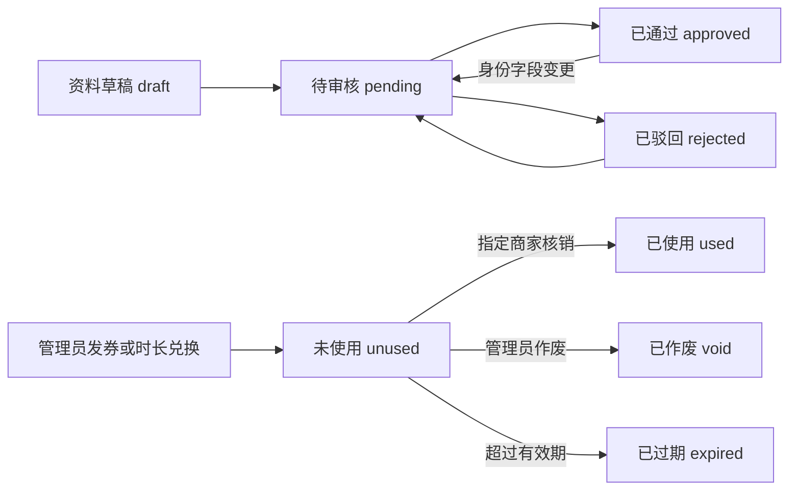
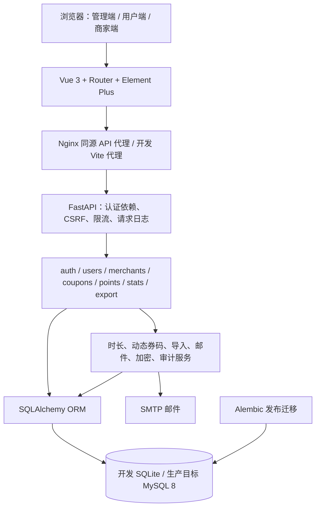
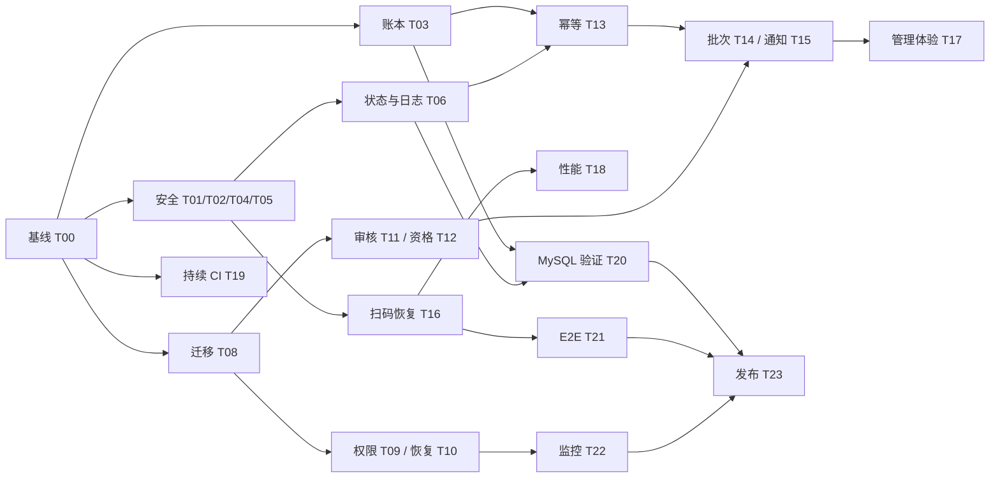

# 青年福利券系统：项目理解与详细开发计划

制定日期：2026-09-05  
评估对象：`D:\卡系统` 当前工作区，包含已有未提交修改  
代码基准：HEAD `b85628e`，本计划以实际工作区源码为准  
计划状态：待实施；本文中的目标、工期和新增接口均为建议方案

## 1. 核心判断

本项目是面向青年公共服务运营的福利券系统，核心价值是把“身份资格、志愿服务时长、指定商家优惠权益、到店核销记录”连接成可追踪的业务闭环。

一期已经具备可运行的主体功能，适合沿现有 FastAPI + Vue 单体架构继续建设。下一轮开发应优先解决安全规则和事务一致性问题，然后完善批量运营、跨端使用和上线保障。现有功能不能仅凭页面存在或旧报告写着“完成”，就视为已经满足生产验收。

建议交付分为三个版本：

| 建议版本 | 目的 | 核心交付 | 发布条件 |
| --- | --- | --- | --- |
| v1.4.1 | 修复关键缺陷，形成可信基线 | 动态码、门店隔离、验证码、会话、账本、核销状态、迁移与权限 | 本文 P0 问题关闭，目标 MySQL 验证通过，关键浏览器链路通过 |
| v1.5 | 提升运营效率和可追踪性 | 审核快照、幂等提交、批次任务、导入预检、可靠通知 | 批次可查询、重试不重复、账本与券可关联 |
| v1.6 | 提升日常使用和运维质量 | 扫码恢复、查询与统计优化、完整 CI、监控和恢复演练 | 用户流程、容量目标、发布与恢复门禁通过 |

版本号是规划建议，不能用作已发布状态说明。安全修复可独立发布，不必等待所有运营增强完成。

## 2. 本次核实范围与验证结果

### 2.1 核实范围

- 阅读产品说明、设计说明、README、部署文档、两份历史优化计划，以及 `HANDOFF.md`、`log.md`。
- 阅读后端数据模型、认证依赖、配置与启动、迁移、七个 API 模块，以及券码、时长、导入和邮件服务关键调用链。
- 阅读前端路由、认证状态、请求拦截器、账号设置、用户券码轮询、商家核销及相关页面调用点。
- 阅读已有后端测试、Playwright 配置及用例、CI、生产服务与备份脚本。
- 使用项目虚拟环境执行后端全量测试，使用现有前端依赖执行生产构建。
- 在临时 SQLite 测试库中复现门店越权读取、验证码错误次数不保留、时长账本余额错误。

根目录 `.env`、`secrets/` 内容未读取或输出。本次未修改业务源码、现有迁移及已有修改日志；新增本文。前端构建生成了被忽略的 `frontend/dist`。未连接生产服务器，未执行生产部署或生产迁移。

注意：现有测试使用 `Settings(env_file=".env")`，测试辅助函数删除 SMTP 环境变量后，配置仍可能从后端本地配置文件回退读取。一次“无 SMTP”用例实际进入邮件排队分支；本次未确认外部投递结果。因此后续运行测试必须先修复配置隔离并屏蔽真实邮件发送，不能宣称现有测试完全无外部副作用。

### 2.2 实测基线

| 检查 | 结果 | 解释 |
| --- | --- | --- |
| 后端 `python -m pytest tests/ -q --tb=short` | **110 passed、4 failed、3 warnings，151.05 秒** | 当前全量回归不通过 |
| 前端 `npm run build` | **通过，Vite 报告构建 8.98 秒** | 构建成功不能替代浏览器验收 |
| 商家 A 读取商家 B 详情 | **HTTP 200** | `/api/merchants/{id}` 缺少门店范围校验 |
| 注册验证码连续输错 6 次 | **6 次均 400，持久化 attempts 为 0** | 错误计数在请求事务结束时没有保留 |
| 时长交错会话：10，入账 5，再扣 2 | **实际余额 13.00，扣减账本 balance_after 为 8.00** | 原子余额正确，账本使用旧读取值计算 |
| 浏览器 E2E | **本次未运行** | 配置含 POSIX 命令和 `.venv/bin/python`，不能直接作为 Windows 验收命令 |
| 生产 MySQL / 公网 / 真实手机扫码 | **本次未验证** | 必须列入发布前独立验收 |

全量测试失败明细：

| 测试 | 当前证据 | 应对方式 |
| --- | --- | --- |
| `test_import_rejects_corrupt_office_files` | 缺少 `openpyxl`，错误发生于模块导入 | 从 requirements 重建完整测试环境，再判断文件异常处理 |
| `test_import_xlsx_docx_and_gbk_csv` | 缺少 `openpyxl` | 同上；同时检查 `python-docx` 等声明依赖的完整性 |
| `test_import_skips_email_notify_without_smtp` | `email_queued` 为 1，期望为 0 | 测试禁用 dotenv 回退，邮件传输统一 mock |
| `test_legacy_database_gets_post_baseline_indexes` | 实际 head 为 `c3e5a281d942`，仍断言 `9d4c17f2ab60`；随后 WinError 32 | 按迁移图验证 head 和字段；资源清理移入 finally，确保异常时 dispose |

其余 warning 涉及 Starlette TestClient/httpx 弃用提示和测试用 HMAC 密钥长度。应单独治理，不能把它们当作上述测试失败的原因。

### 2.3 文档与代码不一致

- README 仍有“生产建议接入 Alembic”，代码已经有正式迁移链。
- README 仍称时长表为“预留”，实际已有入账、扣减、兑换及账本。
- `优化1.md` 已标记完成的 Cookie、路由懒加载、按需组件、结构化日志等，均不应重新规划为从零建设。
- 数据库 engine 已支持 `init_engine()` 重建，但仍在模块 import 时初始化；不能将“完全消除 import 副作用”列为已完成事实。
- “导入支持试运行”需细分：当前用户名单导入支持 `dry_run`，发券导入和时长导入没有同等参数。
- HANDOFF 提及商家只能读取和修改本店资料。当前实际问题是读取范围过宽；修改接口只对管理员开放，尚未发现商家修改他店资料的接口权限。
- 生产配置是否关闭 Bearer、是否完成凭据轮换等，只能通过目标环境验证，不能引用旧说明当作现状。

## 3. 产品与业务理解

### 3.1 四种角色

| 角色 | 已有核心职责 | 必须维护的权限边界 |
| --- | --- | --- |
| 超级管理员 `super_admin` | 全局配置、账号、商家、审核、发券、时长、审计、银行卡解密查看 | 敏感查看必须审计；管理动作明确操作者 |
| 发券管理员 `issue_admin` | 用户审核、商家维护、券模板、发券和作废、时长、业务流水 | 不得管理超管账号，不得读取银行卡明文 |
| 商家 `merchant` | 本店扫码或输入码预览、核销、本店流水与统计 | 对象和查询都按 `account.merchant_id` 限定 |
| 青年用户 `user` | 注册、资料核验、自愿绑卡、查券、出示码、时长兑换 | 只访问本人资料、时长、券及核验记录 |

当前商家账号采用单门店绑定，一个门店可有多个商家账号。系统没有独立的多租户、组织权限树或连锁门店授权模型；后续需求若涉及这些能力，需要另立范围。

### 3.2 主要业务闭环

1. 青年通过邮箱验证码注册，得到账号和初始资料。
2. 用户完善资料并提交核验，管理员通过或驳回。
3. 管理员向已通过用户发放指定商家的券，或入账志愿时长。
4. 用户使用时长兑换指定商家券，扣时长和生成券需要在同一事务完成。
5. 用户出示短时动态码，商家预览后核销。
6. 券进入已使用状态，同时记录核销流水和审计；用户端轮询获知结果。
7. 管理员和商家通过各自范围的记录及导出进行业务核对。

补充入口：名单导入可直接创建已核验账号，使用统一初始密码并强制首次改密；这是一个有明确业务权限的审核替代通道，应保留导入来源证据。

### 3.3 状态机

现有状态模型没有核销撤销、券退款、券转赠、资金结算和时长过期。计划默认不增加这些状态，避免把业务规则尚未明确的能力混入安全修复。

### 3.4 必须建立的业务不变量

- 一张券至多发生一次成功核销；作废和核销不能同时成功。
- 成功核销的门店必须等于券所属门店，且门店可用性符合规则。
- 动态码是有时限的核销凭证；展示编号不能成为可长期核销的替代凭证。
- 时长账户余额不得为负；每次变更都有对应账本，`balance_after` 等于该次串行变更后的实际余额。
- 一次兑换的扣减、券实例和审计应同时成功或同时回滚。
- 对同一次业务提交进行网络重试，不得重复发券、重复入账或重复扣减。
- 核验结果必须对应审核人实际看到的资料版本。
- 改密后所有旧会话失效；前端必须同步进入可重新登录的状态。
- 所有业务核销失败都有可查询的原因记录；限流、格式校验等外围拒绝通过访问日志及指标追踪，避免无限写入业务表。
- 时长仅是志愿服务小时计量。本轮没有证据支持将银行卡绑定等同于银行验证、支付或自动结算。

## 4. 技术架构与模块地图

### 4.1 数据模型

当前 `entities.py` 定义 11 张业务表：

| 数据表 | 职责 | 关键关系/约束 |
| --- | --- | --- |
| `accounts` | 账号、角色、启停、首次改密、会话版本 | 可绑定门店；用户名/邮箱/手机号唯一 |
| `merchants` | 商家基本资料及启停 | 对应商家账号和券模板 |
| `user_profiles` | 身份字段、核验状态、自愿绑卡信息 | 每账号一份资料；银行卡密文存储 |
| `user_verifications` | 核验申请和处理历史 | 当前记录申请说明与审核结果，没有完整身份快照 |
| `coupon_templates` | 名称、说明、指定商家、有效天数、兑换时长 | 实例引用模板；模板信息变化会影响当前关联展示 |
| `coupon_instances` | 用户获得的具体券及生命周期 | 保存商家、失效时间、核销操作人；永久 code 唯一 |
| `redemption_logs` | 核销成功和部分失败记录 | 关联门店、操作人、券和用户 |
| `audit_logs` | 管理与敏感操作审计 | actor、action、target、detail |
| `point_accounts` | 每用户时长余额 | `Numeric(12,2)`，用户唯一 |
| `point_ledgers` | 每次时长变动 | change、balance_after、reason、ref_type/ref_id |
| `email_codes` | 注册、重置密码、绑定邮箱验证码 | 有效期、used_at、attempts |

### 4.2 代码所有权建议

| 领域 | 主要文件 | 下一步调整原则 |
| --- | --- | --- |
| 身份与会话 | `api/auth.py`、`core/deps.py`、`core/cookie.py`、前端 `auth.js`/`api.js` | 统一认证状态清理和密码生命周期，保持 Cookie 主路径 |
| 用户与核验 | `api/users.py`、`schemas/user.py`、前端 `Profile.vue`/`Users.vue` | 增加版本化审核，不把校验仅放前端 |
| 券生命周期 | `api/coupons.py`、`services/live_code.py`、`schemas/coupon.py` | 将状态条件与事务边界集中；稳定外部 API |
| 时长 | `services/points.py`、`api/points.py` | 保留余额唯一变更入口，增强账本和幂等 |
| 批量导入 | `services/import_file.py`、三个业务 API | 统一预检和批次结果，业务校验继续归属各领域 |
| 数据与上线 | `core/migrate.py`、`alembic/`、`deploy/` | 发布阶段迁移，运行账户最小权限 |
| 使用体验 | 现有 layouts、views、扫码与二维码组件 | 延续 PRODUCT/DESIGN 约定，优先修复业务状态衔接 |
| 验证 | `backend/tests/`、`frontend/e2e/`、`.github/workflows/` | 临时数据库、真实 MySQL 并发、浏览器 Cookie 链路 |

继续使用现有技术栈。先通过提取可测试的领域函数减少大 API 文件中的重复，不安排微服务拆分、全量 TypeScript 重写或数据库更换。

## 5. 风险与需求清单

优先级含义：P0 为本轮正式发布阻断项；P1 为运营增强或上线保障；P2 为有条件的性能和体验改进。优先级是当前项目排序，不等同于外部漏洞评级。

| 编号 | 优先级 | 状态 | 事实/风险 | 主要证据 |
| --- | --- | --- | --- | --- |
| R01 | P0 | 源码确认 | 动态 JWT 含永久 code，接口也返回永久码，核销接受永久码 | `services/live_code.py:12`；`api/coupons.py:118,444`；`schemas/coupon.py:60` |
| R02 | P0 | 已复现 | 商家可读取其他门店详情，列表也未按本人门店过滤 | `api/merchants.py:15,72` |
| R03 | P0 | 已复现 | 余额原子更新，账本仍按旧余额计算 | `services/points.py:53,70` |
| R04 | P0 | 已复现 | 验证码错误计数 flush 后抛异常，计数没有持久化 | `services/mail.py:188,222`；`core/database.py:get_db` |
| R05 | P0 | 源码链路确认 | 401 只清 localStorage，未清 reactive state，登录路由可能把用户重定向回受保护页；改密后仍请求旧会话的 me | 前端 `api.js:83`、`auth.js:19`、`router/index.js:75`、`Settings.vue:204` |
| R06 | P0 | 源码确认/并发待验证 | 已使用、作废、过期及竞争失败核销缺日志；作废是普通 ORM 写入，可能与核销竞争；核销条件未包含有效期 | `api/coupons.py:569,597` |
| R07 | P0 | 路径与脚本确认 | 根 `.env`、`secrets/` 未忽略；手工 SQL 创建 `%` 账号并赋予 ALL，安装脚本运行账号也有 ALL | `.gitignore`、`deploy/setup-mysql.sql`、`deploy/install-ubuntu.sh:52` |
| R08 | P0 | 源码确认 | 邮箱码仍为先读取再标记使用，并发只消费一次的保证不足；生产 SMTP 未配置仍走控制台逻辑 | `services/mail.py:145,188` |
| R09 | P0/P1 | 源码确认/场景待验证 | 停用门店未统一阻止预览核销；账号停用再启用未变更会话版本 | `api/coupons.py:420,597`；`api/auth.py:560` |
| R10 | P1 | 实测确认 | 测试依赖不完整、SMTP 配置污染、迁移断言过时 | 本文 2.2 |
| R11 | P1 | 源码确认 | 每个生产 worker 启动时执行迁移，systemd 默认两个 worker；运行最小权限会与此冲突 | `main.py:lifespan`、`core/migrate.py:16`、`deploy/welfare-api.service` |
| R12 | P1 | 源码确认 | 审核记录缺身份快照和并发版本控制 | `models/entities.py:113`、`api/users.py:590` |
| R13 | P1 | 源码确认 | 发券、入账、兑换缺少业务幂等键；重复名单或重试可能重复执行 | `api/coupons.py:259,301,341`、`api/points.py:169,210,322` |
| R14 | P1 | 源码确认 | 两类导入缺预检；错误只保留返回前 100 条；后台邮件没有持久化任务和重试 | `api/users.py:417`、`api/coupons.py:341`、`api/points.py:210` |
| R15 | P1 | 源码确认 | E2E 仅 3 个冒烟场景；使用 Linux 命令；CI 未执行前端 build/E2E | `frontend/playwright.config.js`、`frontend/e2e/core.spec.js`、CI |
| R16 | P2 | 源码确认 | 用户每 1.5 秒拉取全量本人券判断一张券状态；已有列表缺分页 | `views/user/Coupons.vue:169,228`、`api/coupons.py:544` |
| R17 | P1 | 源码确认 | Nuclei 运行命令以 `|| true` 忽略错误，无报告可能被视为无发现；空目标未阻止后续 step | `.github/workflows/security.yml:nuclei-scan` |
| R18 | P1 | 源码确认 | 备份依赖运行数据库账号并读取 dotenv；连接串解析要求显式端口；权限收紧后现有 dump 选项需重审 | `deploy/backup-mysql.sh` |
| R19 | P1 | 待实证 | 文件大小限制在解析前，但行数在完整解析后限制，压缩 Office 文件及超多列可能造成资源压力 | `services/import_file.py:77,91,124` |

R06、R08、R09、R11 等待验证项必须使用隔离环境复现，不能把源码层面的竞争可能直接写成已发生的生产事故。

## 6. 任务分解与验收

估时单位为人日，一个人日按约 6 小时有效研发计。包含实现、对应回归和评审修订；跨阶段任务按主要交付归属估算。负责人为建议职责，可由同一人兼任。

### 阶段 S0：恢复可信的开发与验证基线

#### T00：测试隔离、依赖和当前修改基线

优先级：P0 前置；负责人：后端；估时：2 人日；依赖：无。

1. 清点现有未提交修改，将四项已有安全修改和迁移作为已有工作继承，明确后续提交边界。
2. 从 `requirements-dev.txt` 建立独立完整环境，验证声明的 Office 解析依赖可导入，不直接升级全部依赖。
3. 测试 Settings 显式禁用 dotenv 或注入完整测试配置；测试邮件传输默认 mock，真实 SMTP 探测从自动测试移出。
4. 修复旧 head 硬编码断言：从 Alembic revision 图读取目标，另行断言新增列及类型，避免只检查版本号。
5. engine/session 清理放入 finally；测试失败也应释放 Windows SQLite 文件句柄。
6. 保存后端全量、前端 build 和运行时版本基线；新增缺陷用例时保留其失败原因。

涉及：`tests/_helpers.py`、`test_import.py`、`test_security_hardening.py`、依赖与 CI。

验收：当前 4 个失败逐一关闭；完整测试通过；在临时目录运行不读业务配置、不连接业务数据库、不发送真实邮件；新 head 字段被实际验证。

### 阶段 S1：关键安全与数据正确性

#### T01：动态券码成为唯一常规核销凭证

优先级：P0；负责人：后端 + 前端；估时：3 人日；依赖：T00。

1. 从动态码载荷删除永久券码，保留 `cid`、`uid`、`typ`、`iat`、`exp` 等必要字段，并显式要求必要 claim 存在。
2. 常规预览和核销只接受有效动态码；永久 `code` 改为业务查询编号，不具备核销权限。
3. `LiveCodeOut`、用户券列表、兑换结果、商家预览、导出逐项盘点，移除把永久编号当作备用凭证的展示和约定。
4. 用户仍可复制动态码供商家手动输入，保留无摄像头时的合法路径。
5. 签发和核销都执行状态、归属、门店资格校验；验证码签名用途与登录 token 严格区分。
6. 发布时前后端同步切换，注明旧动态码最长存活周期；不得在动态码校验失败时自动回落永久码。
7. 现有 `test_redeem_with_permanent_code_success` 改为拒绝用例，其他依赖永久码的业务测试改用真实动态码。

涉及：`services/live_code.py`、`api/coupons.py`、`api/points.py`、`schemas/coupon.py`、用户券页/兑换页、商家核销页。

验收：有效动态码可核销；过期、篡改、缺 exp、错误类型、跨用户和跨商家均拒绝；泄露永久编号不能核销；浏览器复制动态码链路可用。

剩余边界：动态码在有效窗口内仍可被拍照转发。本轮承诺短时有效和一次成功核销，不承诺绝对防转发；更强现场确认另行设计。

#### T02：门店范围隔离

优先级：P0；负责人：后端；估时：1.5 人日；依赖：T00。

1. 商家列表对 merchant 角色强制加入本人 `merchant_id`，不能由 query 参数覆盖。
2. 详情在查询阶段限定门店，其他门店统一返回约定的 404 或 403，避免意外暴露联系信息。
3. 审核券列表、核销流水、统计、导出中同类范围限制。
4. 本轮保持门店资料由管理员维护；若以后开放商家自助修改，单设 `/merchants/me`，字段白名单只允许联系资料，不开放启停和账号归属。

验收：两个门店、无绑定账号、普通用户、两类管理员覆盖列表/详情/筛选/导出；商家 A 无法通过对象 ID 或筛选参数得到 B 的数据。

#### T03：时长余额与账本一致

优先级：P0；负责人：后端；估时：3 人日；依赖：T00。

1. 保留条件原子 UPDATE 防透支，去掉使用旧 `current + change` 写账本的做法。
2. MySQL 中使用当前读/行锁和事务内刷新取得本次变更后余额；明确 REPEATABLE READ 下普通快照读取与锁定读取的差别。
3. SQLite 保持兼容路径，验证 UPDATE 后读取和事务串行行为，不把 SQLite 的锁行为等同于 MySQL。
4. 时长账户首次创建处理唯一约束竞争；同一请求内账户、账本、券和审计统一提交。
5. 给兑换账本关联实际券实例，而非仅关联模板；历史记录无法唯一对应时保留原引用并标识历史不完整。
6. 增加只读对账输出：账户余额、变更求和、异常账本。历史修复必须先确定期初余额及排序证据，不自动重写旧流水。

验收：本文 10→15→13 场景最后账本为 13；重复交错入账扣减不丢更新、不透支；并发首次开户仅一条账户；发券失败不扣时长；MySQL 两独立会话并发用例通过。

#### T04：邮箱验证码计数、消费与生产模式

优先级：P0；负责人：后端；估时：2 人日；依赖：T00。

1. 错误次数在返回业务错误前通过明确事务持久化；不要在通用邮件 service 内盲目 commit 其他业务写入。
2. 正确验证码使用条件更新或行锁保证并发只成功消费一次，和注册/绑邮箱/改密的最终事务保持一致。
3. 新验证码发放后的旧码策略显式化；重发冷却和小时上限增加并发测试。
4. 验证码建议存不可逆校验值，日志、错误响应和审计不输出验证码；不能以简单无密钥散列充分保护低熵的六位码，应使用服务端密钥参与校验。
5. 生产缺失 SMTP 时对应发码功能明确返回不可用状态，禁止回落到“成功但只写日志”；调试码只允许隔离开发模式。

验收：通过实际 HTTP 连错达到配置次数后锁定；下一次请求不会恢复 attempts；过期/复用/并发消费拒绝；业务失败按确定的消费策略处理；生产响应与捕获日志没有验证码明文。

#### T05：认证状态与密码生命周期闭环

优先级：P0；负责人：前端 + 后端；估时：2 人日；依赖：T00。

1. 抽出同步 `clearAuthState()`，同时清 reactive state 和本地缓存；401、退出、改密成功共用。
2. 改密成功后按现有后端约定重新登录，移除旧 Cookie 下调用 `refreshAccount()` 的流程；跳转使用 replace，避免回退到失效页面。
3. 页面启动先用 `/auth/me` 恢复登录状态再放行业务路由；过期 Cookie 与残留缓存不能造成重定向循环。
4. 多标签页通过 storage 事件或 BroadcastChannel 同步退出状态，不传输 token。
5. 强制首次改密期间设置页只暴露允许操作，避免邮箱表单反复触发后端拒绝。
6. 账号停用时废止旧会话版本；重新启用要求重新登录。
7. 检查各改密路径是否统一处理首次改密标记；会话版本递增采用数据库原子表达式，覆盖两个并发密码变更。
8. Cookie 专用模式下停止在登录响应体返回真实 access_token；兼容客户端若存在，使用显式配置和受测试的契约。

验收：本人改密、管理员重置、邮箱重置、Cookie 过期、停用再启用均能重新登录；旧 Cookie/Bearer 拒绝；页面无循环跳转；多标签页不保留可用业务状态。

#### T06：券状态竞争与失败核销记录

优先级：P0；负责人：后端；估时：3 人日；依赖：T01、T02。

1. 核销和作废统一采用状态条件更新，核销条件同时校验 `unused`、门店、有效期。
2. 以服务端 UTC 定义 `expires_at <= now` 为不可核销边界；预览只作参考，确认时必须再次校验。
3. 门店停用阻止新的核销；模板停用默认只停止新发放/兑换，已有券是否继续有效按第 11 节规则执行。
4. 将失败原因编码为稳定业务值，例如 `already_used`、`voided`、`expired`、`wrong_merchant`、`invalid_live_code`、`state_conflict`。
5. 已鉴权的业务核销尝试均写一条结果记录；状态事务回滚后的失败记录通过新的明确事务保存。
6. 日志不保存完整动态 token；跨店失败记录的对外序列化不泄露他店用户身份。
7. 成功状态、成功核销记录和业务审计在一个事务提交；响应丢失后能够查询既有结果。

验收：双商家操作员同时核销仅一成功；作废和核销竞争仅一方成功；临界过期拒绝；每个已受理业务失败有原因；失败日志持久化且不泄漏敏感凭证。

#### T07：敏感文件进入版本库的防护

优先级：P0；负责人：后端/运维；估时：0.5 人日；依赖：无。

1. 忽略根 `.env`、本地 secrets、备份和配置副本；保留可审阅的 `.env.example`。
2. 使用 `git check-ignore` 与暂存差异验证规则，不读取敏感内容、不删除已有文件。
3. 增加暂存内容扫描和 CI 密钥扫描，结果脱敏。
4. 部署文档记载历史凭据曾泄漏，收集轮换完成证据；忽略规则不能修复已进入 Git 历史的泄漏。

验收：现有敏感路径不可被普通批量 add 意外纳入；示例配置仍可追踪；扫描报告仅给路径与规则。实际凭据轮换和历史清理作为单独受控运维动作。

### 阶段 S2：数据库迁移与发布可靠性

#### T08：迁移从 worker 启动中分离

优先级：P0 发布前；负责人：后端/运维；估时：2.5 人日；依赖：T00。

1. 将正式 DDL 放在单一发布步骤执行，两个 worker 启动仅验证 schema 已满足版本要求。
2. 历史无 `alembic_version` 库在 stamp 前检查必要表、字段、精度和约束；不能仅凭“存在任意业务表”认定可标为 baseline。
3. 验证四段迁移链：baseline → indexes → must_change_password → session_version。
4. 已有工作区 `c3e5a281d942` 保留为增量迁移；不通过重写已部署基线消除历史差异。
5. 明确失败中断、重复执行、锁等待及退出码；避免发布脚本和启动生命周期同时承担迁移。

验收：MySQL 空库升级、基线库升级、无版本历史库预检、重复升级和错误 schema 拒绝均通过；新 worker 不执行 DDL；缺 session_version 时健康就绪失败。

#### T09：数据库运行、迁移与备份权限拆分

优先级：P0 发布前；负责人：运维；估时：1.5 人日；依赖：T08。

1. 同步修改手工 `setup-mysql.sql` 与自动安装脚本，避免一条部署路径仍赋予 ALL。
2. 应用运行账号只保留核实所需 DML 权限；单独迁移账号执行必要 DDL，凭据不注入常驻 worker。
3. 默认限制本机来源，部署拓扑需要远程数据库时按明确主机范围授权，不默认创建 `%`。
4. 备份账号单独确认 mysqldump 选项和最小权限；不用业务账号直接承担含 routines/events 等选项的全权限备份。
5. 回退脚本保存原授权快照及验证步骤，不在收紧权限后才发现应用或备份依赖 DDL 权限。

验收：运行账号不能 DROP/ALTER/GRANT；全部业务测试通过；迁移账号可升级；备份账号能生成并恢复有效备份。

#### T10：可恢复的备份和发布回退

优先级：P1，首次正式发布前完成；负责人：运维；估时：2 人日；依赖：T08、T09。

1. 数据库 URL 使用结构化解析，覆盖无显式端口、密码特殊字符等项目支持格式；避免命令行暴露密码。
2. 备份先写临时文件，成功且校验通过再发布完成标记；失败备份不得触发保留期清理的成功流程。
3. 数据和解密密钥有对应版本与校验清单；存储访问受限，异地备份加密。
4. 在隔离 MySQL 恢复，验证表数量、关键行数、余额、券状态及合成银行卡字段解密。
5. 以发布包和数据库 schema 兼容性制定回退方案；已有新业务写入时优先前向修复，不机械 downgrade 删除字段。

验收：备份故障可发现；隔离恢复成功；记录实际恢复时间；服务回退步骤可执行。建议初始 RPO 24 小时、RTO 2 小时，待业务要求和演练实测确认。

### 阶段 S3：业务规则与批量运营

#### T11：审核资料快照及并发审核

优先级：P1；负责人：后端 + 前端；估时：2.5 人日；依赖：T00、T08。

1. 引入资料版本，申请保存真实姓名、学号、组织及材料说明快照，审核页面展示申请快照。
2. 待审期间资料变化使旧审核决定不能批准新版资料；选择更新申请版本或替代申请时保留原记录。
3. 审核通过/驳回使用 expected_version 或状态条件更新，两个管理员处理同一申请只有一个有效结果。
4. 批量审核返回逐条成功、已处理、版本冲突和不存在结果，不能仅给模糊总数。
5. 名单直接核验保留导入批次、来源和操作者，避免形成没有来源的 approved 状态。
6. 前端适配“已通过用户改资料后自动创建待审”的流程，避免随后重复提交核验接口报错。

验收：管理员打开旧申请后用户改资料，旧决定不能批准新资料；双人审核不互相覆盖；历史可回看实际审核内容；批量统计与实际结果一致。

#### T12：业务资格规则统一

优先级：P1；负责人：后端/产品；估时：1.5 人日；依赖：T02、T06、T11。

1. 将账号启用、用户核验、门店启用、模板启用的资格判断列成行为矩阵。
2. 新发券、批量发券、名单发券、时长调整、兑换复用同一领域资格检查。
3. 兑换目录过滤不能兑换的门店，不让用户点击后才发现商家停用。
4. 明确资料复核中是否允许使用已发券、模板停用是否影响已发券、时长调整是否需要额外原因。
5. 模板名称和描述作为权益内容时，建议实例保存发放时快照；历史无快照记录不伪造历史规则。

验收：单条/批量/导入入口对同一对象得到相同资格判断；停用和复核边界用例通过；规则写入产品文档。

#### T13：写操作幂等与结果查询

优先级：P1；负责人：后端 + 前端；估时：3 人日；依赖：T03、T06、T08。

1. 发券、时长调整和兑换支持 `Idempotency-Key`，业务键按操作者、操作类型和租用期限限定范围。
2. 新增最小幂等记录，保存请求摘要、处理状态和结果关联；敏感原始请求不直接存储。
3. 同 key 同请求返回原结果；同 key 不同请求返回冲突；同 key 并发提交只执行一次。
4. 幂等记录与业务写入同事务，不能出现“记为完成但券/账本未落库”。
5. 前端在一次操作期间复用同 key，超时后查询结果；重新发起独立业务必须新 key。
6. 明确保留周期，例如先采用 7 天；业务批次长期留档与短期请求幂等区分。

验收：成功响应丢失后重试不多发券、不多扣时长；同 key 并发和进程中断场景可恢复；冲突返回可理解的业务错误。

#### T14：统一导入预检、批次和逐行结果

优先级：P1；负责人：后端 + 前端；估时：4 人日；依赖：T11、T12、T13。

1. 三类导入均提供“上传解析 → 预检 → 确认执行 → 批次结果”流程，执行时重新验证，预检结果不代替执行时资格检查。
2. 保存批次类型、操作者、文件摘要、状态、计数和逐行结果；原文件是否保留按数据保留策略决定。
3. 用户名、邮箱、手机号、学号使用明确匹配优先级，跨字段命中不同用户时报告歧义；姓名不作为唯一标识。
4. 文件内同一用户重复项先提示并明确聚合/拒绝策略，不能静默重复发券或入账。
5. 逐行执行使用正确的事务或 savepoint 边界，处理唯一约束冲突后 session 可继续；跨行异常必须在结果中反映。
6. 保留全部错误明细，分页查询和 CSV 下载；前端可以只展示前 100 条，但不能丢弃其余错误证据。
7. 解析时就限制行、列、单元格长度、解压体积和异常压缩比；覆盖空表、损坏文件、编码、长数字、前导零、NaN/Infinity 与数值溢出。
8. 1000 行涉及大量密码哈希，先测耗时；超过请求窗口时使用数据库持久化批次和轻量 worker，不默认引入大型队列平台。

验收：预检不写业务数据；混合正确/错误文件逐行结果可解释；执行失败后可查询已完成进度；只重试失败行且不重复入账；高资源文件快速拒绝。

#### T15：账号激活与可靠邮件通知

优先级：P1；负责人：后端 + 前端；估时：3 人日；依赖：T04、T05、T08、T14。

1. 新导入账号优先使用一次性激活链接或个人初始凭证，逐步替代所有用户共用固定初始密码。
2. 无邮箱账号保留受控发放个人凭证方案，强制首次改密；不把密码持续展示在可重复下载的历史报表里。
3. 增加最小邮件 outbox，与创建账号事务一起记录待发送任务。
4. worker 领取任务、重试退避、重试上限和人工重发可查询；只报告已排队、SMTP 已受理、失败，SMTP 已受理不等于用户已收件。
5. HTML 内容进行适当转义，日志和任务结果不保存初始密码或激活 token 明文。

验收：进程重启不会丢掉待发送任务；永久失败可见；重复点击激活不能重复消费；错误通知不回滚已经成功创建的账号。

### 阶段 S4：核心使用流程与性能

#### T16：用户出码与商家扫码的异常恢复

优先级：P1；负责人：前端；估时：3 人日；依赖：T01、T05、T06。

1. 券码弹窗覆盖加载、有效、刷新中、断网、已过期、已作废、已核销和会话失效状态。
2. 倒计时按服务端 expires_at 校准；切后台再回来重新同步，不能只依赖每秒减一。
3. 关闭弹窗/切换券/离开页面取消请求和定时器，使用请求代次避免晚到响应恢复旧二维码。
4. 轮询请求单飞，页面隐藏暂停，网络错误退避；恢复网络后重新签发动态码。
5. 商家扫到码后锁定对应预览；输入变化、动态码过期或重复扫码时清理旧预览，确认核销前重新验证。
6. 保留摄像头、相册、复制动态码三种入口；权限拒绝和无摄像头有可用退路。
7. 核销请求超时显示结果确认状态，通过业务结果查询确认，不能把重试结果“已使用”直接当作本次成功。

验收：桌面 1440×900、手机 390×844 和 360×800 核心内容可读、无重叠；页面切换后无残留摄像头和轮询；双浏览器真实完成出码→预览→核销→用户成功状态。

#### T17：管理员高频操作完整性

优先级：P1；负责人：前端；估时：2 人日；依赖：T11、T13、T14。

1. 待审核、发券、时长调整和导入统一 loading、空结果、请求失败、部分成功状态。
2. 批量操作区分当前页选中与全部筛选结果，跨页选择不得隐式扩大范围。
3. 筛选、分页、日期区间和导出条件保持一致，操作后保留合理的工作位置。
4. 发券/扣时长/作废的确认包含对象、数量、商家和影响；重复点击在 UI 与服务端同时防护。
5. 路由声明补充超管专用页面约束，与菜单隐藏及后端权限一致。
6. 所有时长展示统一两位小数；前端不承担精确余额计算。

验收：管理员能够独立完成“筛选待审→处理→发券/入账→查看逐条结果→导出”，失败后有继续处理入口；四角色直接输入 URL 的访问结果正确。

#### T18：状态查询、分页与统计口径

优先级：P2；负责人：后端 + 前端；估时：2 人日；依赖：T06、T16。

1. 新增本人单券状态查询，使出码弹窗不再每 1.5 秒读取全部券；普通轮询先满足需求，不默认引入 WebSocket。
2. 本人历史券和核验待办增加明确分页，保持稳定排序；通过版本兼容或前后端同批升级处理响应结构变化。
3. 统计和导出统一业务时区；建议业务按 Asia/Shanghai，自数据库 UTC 转换到半开时间区间查询。
4. 依据执行计划补索引，保留已有查询数量回归，先测量再优化。
5. 统一构建分析入口，修正 `--mode analyze` 与当前手工检测 `--mode=analyze` 不一致的问题；记录实际首屏依赖，不用最大 chunk 替代首屏体积。

验收：单券轮询成本不随用户券数增长；分页无重复遗漏；北京时间跨午夜的列表、仪表盘和导出一致；性能达到第 9 节初始目标。

### 阶段 S5：自动验证、可观察性和发布交付

#### T19：CI 成为有效质量门禁

优先级：P1；负责人：后端/运维；估时：2 人日；依赖：T00。

1. 加入前端 `npm ci` 和 `npm run build`；自动 E2E 在隔离环境运行。
2. 对修改范围配置 Python/Vue 静态检查，逐步纳入存量，避免一次格式化全仓库。
3. 修复 Nuclei 空目标继续执行和 `|| true` 吞错误；清楚区分“未运行”“扫描失败”“无发现”“有发现”。
4. pip/npm 审计明确生产与开发依赖范围；例外必须有原因、负责人和期限。
5. 保存测试结果、失败 trace、迁移与扫描报告，输出不得包含凭据。

验收：代码构建错误、业务测试失败、扫描工具失败都会使对应 job 失败；没有 staging 目标时明确跳过，而不是输出无风险。

#### T20：MySQL 事务与迁移专项回归

优先级：P0 发布前的必要部分，后续扩展 P1；负责人：后端/测试；估时：3 人日；依赖：T03、T04、T06、T08。

1. 使用临时 MySQL 8 service，固定字符集和事务隔离级别，CI 与发布目标保持一致。
2. 并发测试使用两个独立连接和屏障，确保操作真正交错，不用连续调用冒充并发。
3. 覆盖余额与账本、首次开户、双核销、作废竞争、验证码消费、审核竞争和幂等竞争。
4. 覆盖 MySQL 大小写不敏感唯一性、邮箱用户名碰撞、Decimal 精度和日期边界。
5. schema 升级采用空库、历史带数据、重复执行和失败中断矩阵；业务数据必须保留。

验收：关键不变量在 SQLite 快速回归和 MySQL 集成回归同时成立；死锁如发生只对可重试的幂等事务有限重试并可观测。

#### T21：跨平台真实浏览器回归

优先级：P0 核心链路，P1 扩展；负责人：前端/测试；估时：2.5 人日；依赖：T05、T16、T17、T19。

1. 用跨平台启动脚本替换 POSIX 拼接命令，显式选择 `.venv/Scripts/python.exe` 或 `.venv/bin/python`。
2. 后端/前端端口参数化，同时更新 Vite proxy、HMR 和 baseURL。
3. 使用独立随机测试库和服务标记，默认不复用已有 19001/5173 业务服务，防止 E2E 修改开发数据。
4. 建立四角色登录、首次改密、过期会话、用户核验、管理员发券、兑换、双会话核销和错误恢复链路。
5. 摄像头算法自动测试使用可控图片；真实 Android/iOS 摄像头权限、相册和 HTTPS 信任单独实机验收。

验收：Windows 开发机和 Linux CI 同一命令通过；用例实际产生并核销一张券；测试只操作隔离数据；失败自动留 trace 和截图。

#### T22：健康、业务指标与告警

优先级：P1；负责人：后端/运维；估时：1.5 人日；依赖：T06、T10。

1. 保留轻量 liveness，增加检查数据库连接和 schema 版本的 readiness；健康响应不暴露配置内容。
2. 记录请求量、错误率、响应耗时、核销成功/失败原因、锁等待、后台任务积压、最近备份结果。
3. request_id 关联 API、业务日志和必要的审计记录；银行卡、完整码、验证码与密码均脱敏或排除。
4. 先接现有可用的日志/告警方案；告警阈值基于上线初期基线调整。

验收：模拟数据库不可用、备份失败、任务积压时能够发现；健康存活正常但数据库失效时 readiness 不能继续报就绪。

#### T23：文档一致性与发布验收包

优先级：P1；负责人：全栈/运维；估时：2 人日；依赖：对应版本已交付任务。

1. 同步 README、PRODUCT、部署说明、API 契约和变更日志，删除过时的“未实现/已预留”说法。
2. 安全修改按现有 `log.md` 风格记录文件、行为、验证命令和实际结果；本次计划不回写历史结果。
3. 发布包包含版本、迁移 head、前后端构建校验、配置键清单、风险说明、恢复步骤。
4. 在 staging 走完整角色验收，完成脱敏样例数据、运营操作说明和故障处理说明。
5. 发布后观察核销失败分布、401、兑换错误和任务积压，满足观察窗口后关闭发布任务。

验收：新维护者仅凭文档能建立隔离开发环境并完成演示；部署人员能识别升级前置条件、失败退出和回退路径。

#### T25：商家详情页（门头照 / 位置 / 电话 / 唤起导航）

优先级：P1；负责人：全栈；估时：1 人日；依赖：无（基于既有 Merchant 资料扩展）。

1. 用户端券行「指定商家」可点进商家详情页：门头照、地址、联系电话（tel:）、简介；位置支持唤起地图导航。
2. 门头照由管理员在商家管理页上传（JPEG/PNG/WebP，默认 5MB 上限），原图入库（MySQL MEDIUMBLOB）、同源提供，兼容现网 CSP `img-src 'self'`；魔数校验，不信任上传方 Content-Type。
3. 商家可填 GCJ-02 经纬度（高德坐标拾取器复制）：高德/腾讯/百度三家导航直链（URI API，无需 key）；未填坐标时退化为按地址关键词搜索。
4. `GET /api/merchants/{id}` 对 user 角色开放（门店公开展示信息）；新增门头照上传/查看/删除端点，写操作仅管理员并记审计。
5. 迁移：merchants 新增 photo_blob / photo_content_type / photo_updated_at / longitude / latitude；生产走 `deploy/migrate-release.sh`。

验收：用户从券行一键查看门店照片、地址、电话并可在地图 App 中导航；无坐标/无照片时均有合理降级；越权（用户写商家资料、传照片）被拒并有测试覆盖。

## 7. 数据结构和 API 演进建议

以下都是规划接口，尚未存在；具体路径可与现有路由风格对齐。

### 7.1 数据变化

| 变化 | 对应任务 | 迁移与历史兼容 |
| --- | --- | --- |
| `accounts.session_version` | 已有工作区修改，T05/T08 接续 | 保留现有迁移；上线前检查字段存在 |
| 资料版本与核验快照 | T11 | 新申请完整快照；旧申请标记历史未知，不能把当前资料冒充旧资料 |
| 券权益快照、账本券关联 | T03/T12 | 新数据写入；历史映射只有唯一可证明时回填 |
| 幂等记录及唯一范围约束 | T13 | 有清理周期，重复请求返回业务对象关联 |
| 导入批次和逐行结果 | T14 | 不追溯伪造旧批次；原始文件单独确定保留策略 |
| 激活凭证与邮件 outbox | T15 | 凭证存校验值；新账号先使用，旧账号按策略兼容 |
| 核销失败原因码 | T06 | 历史记录保留原 message，原因无法判断时标为 legacy_unknown |

若轻量批次即可满足规模，优先数据库任务表加单独 worker，避免同时引入 Redis、Celery 和额外消息中间件。只有测量得到吞吐或重试隔离需要时再扩展。

### 7.2 API 契约

| 接口/契约 | 建议变化 | 兼容方式 |
| --- | --- | --- |
| `GET /coupons/instances/{id}/live-code` | 不返回永久核销凭证，明确过期时间 | 前后端同步升级 |
| `POST /coupons/preview` | 动态凭证通过 body 传输，减少 query 日志暴露；预览只读 | 短暂兼容旧 GET 时禁止记录查询凭证，然后移除 |
| `POST /coupons/redeem` | 仅动态码，返回稳定结果码和券状态 | 更新商家页面和原永久码测试 |
| `GET /coupons/instances/{id}/status` | 仅本人查询的轻量状态 | 新增接口，不开放任意券枚举 |
| 发券/时长/兑换写接口 | 可审计的幂等键及冲突约定 | 完成服务端后升级前端；生产关键写入最终要求幂等 |
| `POST /imports/preview` | 类型、文件、参数返回预检结果 | 新增统一入口，旧导入阶段性保留 |
| `POST /imports/{id}/execute` | 确认执行，重新验证并采用批次幂等 | 预检内容摘要变化则拒绝 |
| `GET /imports/{id}`、结果导出 | 任务状态、计数、逐行错误 | 管理员范围访问，错误字段脱敏 |
| 审核接口 | `expected_version` + 逐项批量结果 | 前端更新后强制版本检查 |
| 错误响应 | 渐进增加 `code`、`message`、`request_id` | 保留现有 `detail`，更新 axios 后再统一 |

不把改成 REST 命名本身当作交付收益；只对实际修复问题所需的契约做修改。

## 8. 依赖、里程碑与工期

### 8.1 工作量汇总

| 阶段 | 任务 | 基准人日 | 完成标志 |
| --- | --- | ---: | --- |
| S0 | T00 | 2 | 测试与开发基线可信 |
| S1 | T01–T07 | 15 | 核心安全和账务问题关闭 |
| S2 | T08–T10 | 6 | MySQL 迁移、权限、恢复可验证 |
| S3 | T11–T15 | 14 | 运营流程可重试、可追溯 |
| S4 | T16–T18 | 7 | 核心扫码和管理流程完整 |
| S5 | T19–T23 | 11 | 自动门禁、监控与发布交付 |
| 合计 | 24 个任务 | **55** | 本轮完整计划交付 |

加约 20% 联调、历史数据差异和评审缓冲后，预算约 **66 人日**。这是基于当前源码的估算，不是工期承诺；T00、T08 和首轮 MySQL 并发结果出来后应重估。

- 1 名全栈主力独立执行：约 13–15 周，另需运营和部署资源配合。
- 1 名后端 + 1 名前端，另有兼职测试/运维：约 8–10 周日历周期；并行受后端任务比例和 staging 可用性限制。
- 若只做 v1.4.1，应裁剪为 S0/S1/S2 加必要的 T19/T20/T21/T22/T23 子任务，另行汇总，不直接把 55 人日当成安全补丁工期。

### 8.2 依赖关系

测试和 CI 必须随任务推进，S5 不是“最后才开始测试”。T07 可立即执行；前端 T05 可与后端 T01/T03 并行；数据库权限必须在迁移从应用启动移出后再收紧。

### 8.3 两名开发的建议节奏

| 时间 | 后端重点 | 前端重点 | 门禁 |
| --- | --- | --- | --- |
| 第 1 周 | T00、T04、T02、T07；启动 MySQL 环境 | T05；跨平台 E2E 启动基础 | 当前全量失败关闭，认证可回归 |
| 第 2 周 | T01、T03、T06 | 动态码契约适配、基础扫码回归 | 永久码拒绝、账本一致、状态竞争通过 |
| 第 3–4 周 | T08–T10、T20；发布前补充 T19/T22 | T16、T21 核心链路 | v1.4.1 staging 发布门禁通过 |
| 第 5–6 周 | T11–T14 | 审核版本、导入预检、批次结果 | 幂等和批次可演示、可追溯 |
| 第 7–8 周 | T15、T18、监控与对账 | T17、E2E 扩展、移动端验收 | v1.5/v1.6 候选包 |
| 第 9–10 周 | 历史数据、恢复演练、缺陷缓冲 | 实机修订、交付文档 | T23 完成并交接 |

早期安全缺陷若已在运行环境中暴露，应先单独发布完成验证的小补丁，不为了凑齐里程碑而等待整个阶段。

## 9. 验证矩阵与可量化验收

### 9.1 功能与安全矩阵

| 领域 | 必须覆盖 | 执行层 |
| --- | --- | --- |
| 认证 | Cookie 登录、过期、退出、三种改密、首次改密、多标签页 | API + 浏览器 |
| 越权 | 四角色 × 列表/详情/写入/导出；两个门店和两个用户 | API 为主，路由补充 |
| 核验 | 初次审核、复核、旧快照、双审核、批量部分冲突 | API + MySQL + 浏览器 |
| 券 | 发放、动态码、过期、作废、跨店、竞争核销 | API + MySQL + 双浏览器 |
| 时长 | 小数、负数、零、溢出、透支、并发、账本、兑换回滚 | service + API + MySQL |
| 幂等 | 双击、请求重试、响应丢失、同 key 不同 payload | API + MySQL + 浏览器 |
| 导入 | 四格式、GBK、空/损坏/大文件、重复、歧义、预检、恢复 | 解析单测 + API |
| 邮件 | 发码限制、消费次数、SMTP 失败、outbox 重试、激活 | mock 集成，不发真实邮件 |
| 迁移 | 空库、旧库、重复升级、缺列、升级失败、运行无 DDL | 隔离 MySQL |
| 运维 | readiness、依赖扫描失败、备份失败、恢复、回退 | staging/隔离演练 |

### 9.2 性能目标草案

以下是待压测确认的验收目标，不是项目当前性能：

| 场景 | 初始目标 | 测量约束 |
| --- | --- | --- |
| 常规分页列表 | P95 ≤ 500 ms | staging 类生产硬件，50 条/页，注明数据库规模和缓存状态 |
| 动态码生成/单券状态 | P95 ≤ 300 ms | 不含用户公网传输，关注数据库查询次数 |
| 核销确认 | P95 ≤ 500 ms，业务竞争结果正确 | 50 并发请求起测，区分预期业务拒绝和 5xx |
| 券列表 SQL 数 | 不随页内记录数线性增长，主路径目标 ≤ 3 次 | 排除登录等独立请求；明确是否含过期维护语句 |
| 1000 行导入 | 无反向代理超时；异步时迅速返回 task ID | 先测密码哈希和 Office 解析成本，再确定同步上限 |
| 用户获知核销成功 | 正常前台网络下 ≤ 3 秒 | 单券轮询，浏览器后台节流另行说明 |
| 移动端核心操作 | 360 px 宽无关键操作遮挡 | Chromium 自动测试 + Android/iOS 实机 |

初始压测数据建议：1 万用户、10 万券实例、30 万账本/核销记录级别，均使用合成数据。真实预期规模若更小或更大，调整目标并保留测试参数。

### 9.3 完成定义

- 改动对应一个明确业务行为或不变量，有正常和关键失败场景验证。
- 受影响 API、前端和数据库迁移同步，不能仅改后端后宣称用户流程完成。
- 关键事务在真实 MySQL 验证，不能只以 SQLite 测试通过作为生产并发证明。
- 所有已知 P0 已关闭；测试失败、未运行和例外均显式列出。
- 兼容期、历史数据处理、发布步骤和回退限制写清楚。
- 本轮关键模块缺陷路径有覆盖；覆盖率作辅助指标，不以凑比例替代场景测试。
- 日志、导出、通知、截图和测试报告没有真实敏感数据。

## 10. 发布步骤与运行边界

1. 在隔离 staging 准备与生产一致的 MySQL 主版本、反向代理和 Cookie 配置。
2. 确认目标版本、代码差异、已有未提交工作的归属以及需要执行的迁移。
3. 生成发布前数据库备份和密钥版本清单，检查最近一次恢复演练证据。
4. 使用迁移账号单次执行迁移，核对 head、必要列和索引，再启动应用运行账号。
5. 部署匹配的前端包，重点确认动态码契约和认证返回结构兼容。
6. 验证 liveness/readiness、登录 Cookie、安全头、四角色业务及数据库授权。
7. 使用合成测试用户完成一次“核验→入账→兑换→动态码→商家核销→流水核对”。
8. 验证失败核销和重试，不向真实运营账户发券或写入测试时长。
9. 观察 401/5xx、核销失败原因、余额异常、任务积压和备份状态。
10. 故障时按问题选择切回兼容前端/应用、禁用新入口或前向修复；涉及数据库恢复时明确停写和潜在数据丢失窗口。

现有 `/api/health` 主要是进程存活响应，不执行数据库查询，不能单独证明业务可用。现有生产状态、DNS、证书和端口本次均未核实，发布前应获取实时证据。

## 11. 需要在对应开发项开始前确定的业务规则

下表给出默认建议，不阻碍先实施已确认的缺陷修复。它们不是已获确认的新增业务需求。

| 决策 | 默认建议 | 影响任务 |
| --- | --- | --- |
| 是否保留永久码核销 | 常规核销关闭，手动输入也使用动态码 | T01 |
| 商家能否修改门店资料 | 本轮由管理员维护；后续仅开放本人联系资料 | T02 |
| 已核验用户进入复核后，已有券是否可用 | 暂停新发券/兑换；已有券默认保留，除非业务明确要求资格撤销立即冻结 | T12 |
| 模板停用是否影响历史券 | 只停止新增；历史券按实例有效期处理 | T06/T12 |
| 商家停用是否影响核销 | 停止新核销，保留历史查询和审计 | T06 |
| 导入是否继续直接核验通过 | 仅管理员可信名单允许，要求来源记录 | T11/T14 |
| 批次失败策略 | 独立行可部分成功，明确结果；同一次兑换必须全事务成功 | T13/T14 |
| 相同名单重复执行是否允许 | 默认提示重复批次；确有新的业务发放需创建独立批次及原因 | T13/T14 |
| 时长过期/冻结/退款 | 本轮不引入；先保持现有小时余额模型 | 后续专题 |
| 券面额、总库存、个人领取上限、活动预算 | 源码尚无完整模型，确认实际运营需求后单独立项 | 二期专题 |
| 数据与审计保留期限 | 在业务与隐私要求明确后配置；不得直接清理历史数据 | T10/T14/T22 |
| 用户规模、并发扫码量、RPO/RTO | 先按本文目标草案测量，再根据运营要求调整 | T10/T18/T20 |

如果要做微信小程序、银行接口、财务结算、跨组织多租户、活动库存预算，应分别补产品流程、角色授权、数据模型、接口和预算，不能默认包含在本轮 55 人日内。

## 12. 实施检查表

下列状态均为本计划制定时状态，不代表代码已经完成。
（2026-09-05 更新：T00–T07 已实施并记录于 `log.md` 同日条目；T08–T10、T20 及审查报告
F01–F05 修复已于同日第二批完成；二次审查 F06/F07 已修复——夹具自动供给端到端跑通
16/16×3 轮，CI 测试连接串改无密码后扫描门禁通过；T11 已于同日第四批完成。）

- [x] T00 开发和测试基线恢复。（2026-09-05：4 个失败关闭；测试 Settings 与本地 `.env` 隔离；迁移 head 断言改由迁移图推导）
- [x] T01 动态码常规核销契约完成。（2026-09-05：载荷去永久码、预览/核销仅收动态码、前端同步；MySQL 双核销竞争已由 T20 套件验证）
- [x] T02 商家对象范围隔离。（2026-09-05：列表/详情/券/流水/导出按绑定门店限定）
- [x] T03 时长余额、账本和兑换关联一致。（2026-09-05：SQLite 与 MySQL 双会话、并发开户均已验证）
- [x] T04 验证码错误计数与原子消费。（2026-09-05：计数独立事务持久化、条件更新消费、HMAC 存储、生产无 SMTP fail-closed；F02 修复后资格边界全原子化）
- [x] T05 会话失效与前端状态同步。（2026-09-05：后端原子版本递增/停用废止会话/Cookie 专用模式；前端 clearAuthState/ensureAuthReady/多标签同步）
- [x] T06 核销/作废竞争和失败日志。（2026-09-05：条件更新含有效期、失败原因码、跨店失败脱敏、停用门店拦截留痕；F01 修复后过期转换也走条件更新）
- [x] T07 敏感文件忽略与扫描。（2026-09-05：gitignore 规则、scan_staged_secrets.py、CI secret-scan job；F04 修复后覆盖 mysql+pymysql 与 SSH_PASS 形式；凭据轮换仍为独立运维动作）
- [x] T08 发布迁移独立执行。（2026-09-05：生产 worker 只读校验 verify_schema_current，DDL 由 migrate-release.sh 以迁移账号执行；迁移矩阵 6 用例通过）
- [x] T09 运行、迁移、备份账号权限拆分。（2026-09-05：setup-mysql.sql 三账号仅 localhost 最小权限；临时实例演练 DDL 拒绝/迁移成功/备份可用）
- [x] T10 备份恢复与回退验证。（2026-09-05：备份临时文件+校验+原子发布；restore-mysql.sh 对账校验；隔离实例完成备份→恢复→PASS 演练；季度演练节奏见 deploy/README.md）
- [x] T11 核验版本与快照。（2026-09-05：申请快照+版本条件审核、旧申请 superseded、批量逐条结果、导入来源记录；SQLite 7 用例通过，MySQL 双审核竞争已写入 T20 套件）
- [x] T12 资格与券规则统一。（2026-09-06：资格判定集中到 services/eligibility.py，发券/入账/兑换五入口复用；停用账号新增拦截；兑换目录过滤停用门店；券实例保存发放时模板快照（迁移 a9d3e71b2c05）；行为矩阵写入 PRODUCT.md；9 个新回归用例通过）
- [x] T13 写操作幂等。（2026-09-06：idempotency_keys 表（迁移 b6c2f84a1d09）+ services/idempotency.py；发券/时长/兑换 7 接口支持 Idempotency-Key 重放、409 冲突与并发单胜者；前端按操作意图复用 key；SQLite 11 用例 + MySQL 竞争用例）
- [x] T14 导入预检、批次和完整结果。（2026-09-06：import_batches/import_rows 表（迁移 c7e1d95b3a10）+ services/imports.py 预检/逐行独立事务执行/断点续执；/imports preview/execute/detail/rows/rows.csv；歧义解析、文件内重复拒绝、解析资源上限、users 批次共用密码哈希（1000 行 157s→0.16s）；前端 ImportWizard 三入口接入；11 用例通过）
- [x] T15 激活与可靠邮件任务。（2026-09-06：activation_tokens（HMAC 摘要、单次消费、会话版本递增）+ email_outbox（同事务入队、条件领取、退避重试、上限转 failed 可人工重发）；导入双轨——含邮箱走激活链接（占位哈希随机不可知、发送成功后清空正文），无邮箱/关闭通知走一次性个人凭证；/auth/activate 公开端点 + 前端 /activate 落地页；/outbox 管理（查询不回正文 + resend）；转义与无明文 token/密码落库；10 用例通过）
- [x] T16 用户出码和商家扫码恢复。（2026-09-06：核销接口幂等键（同 key 重试重放原结果）；出码弹窗状态机（加载/有效/刷新中/断网/已过期/已作废/已核销），倒计时服务端校准 + visibilitychange 重同步，请求代次防晚到响应，轮询单飞/隐藏暂停/退避；商家页预览锁定 + 确认前重新预览 + 超时结果确认（流水查询 + 同 key 重试）；3 后端用例 + E2E 全绿）
- [x] T17 管理员高频操作完整性。（2026-09-06：超管页面路由 roles 声明（守卫取最深 roles，与菜单/后端三层一致）；formatHours 统一两位小数；/export/users 补 q 搜索与列表筛选一致；发券/批量/时长/作废确认补对象/数量/商家/影响 + loading 防重；批量弹窗注明仅当前页选中、部分成功列失败明细且保留选中续处；2 用例）
- [x] T18 状态查询、分页和统计口径。（2026-09-06：/instances/{id}/status 单券轻量查询（弹窗轮询 O(1)）；/coupons/my 升级 Page{total,items} + 稳定排序，待办 limit；services/biztime.py Asia/Shanghai 划日统一仪表盘/导出口径；npm run analyze 统一构建分析入口；5 用例）
- [x] T19 CI 门禁有效。（2026-09-05：secret-scan + mysql service；2026-09-06：前端 build/E2E job 接入 + Nuclei 错误语义修复——扫描失败/目标未配置/无发现/有发现四态可区分，审计脚本 API 不可用 exit 2，external_scan.ps1 汇总失败步骤；静态检查与依赖审计例外登记可后续增强）
- [x] T20 MySQL 并发与迁移验证。（2026-09-05：test_mysql_concurrency.py 10 用例 + test_mysql_migration.py 6 用例，本地 MySQL 8.4 通过；CI 已配 mysql:8.4 service；2026-09-06：新增核销幂等竞争用例）
- [x] T22 健康、指标和告警。（2026-09-06：/api/ready readiness（数据库失效/schema 落后 → 503）；/api/metrics 仅超管（请求量/5xx/耗时/核销原因分布/outbox 积压/最近备份）；backup-mysql.sh 成败写状态文件；6 用例含数据库失效验收）
- [x] T21 跨平台 E2E 与手机验收。（部分：2026-09-05 Playwright 套件 12 用例跨平台可重复运行（Windows 实证 3 轮全绿、CI 已接 frontend-e2e job，覆盖四角色/首改密/过期会话/核验/发券/兑换/双会话核销/错误恢复）；真实手机摄像头与 HTTPS 信任待实机验收）

- [x] T23 发布验收包和文档交接。（2026-09-06 代码侧完成：版本 1.5.0、发布验收包 docs/release-v1.5.0.md（迁移 head/升级前置/回退路径/风险/观察窗口/角色验收清单）；README/PRODUCT/deploy-README 过时说法已清理；staging 实机角色验收与发布后观察窗口属运维动作）

- [x] T25 商家详情页。（2026-09-12：用户端 /user/merchants/:id（原生组件实现，门头照/地址/电话/三家地图导航直链＋地址搜索兜底）；商家管理页上传门头照（魔数校验、原图入库 MEDIUMBLOB、5MB 上限）与 GCJ-02 经纬度；GET /merchants/{id} 开放 user 角色，照片上传/删除仅管理员并记审计；迁移 c8d5e1f3a27b；后端 8 用例 + E2E 3 用例）

> 历史注：计划编制时的「建议首个工作包」排序（T00+T07→T04/T02/T05/T01/T03/T06→T08/T20）
> 已按此顺序完成；发现的前置规则变化均已回写相关任务，不沿用失效估算。
